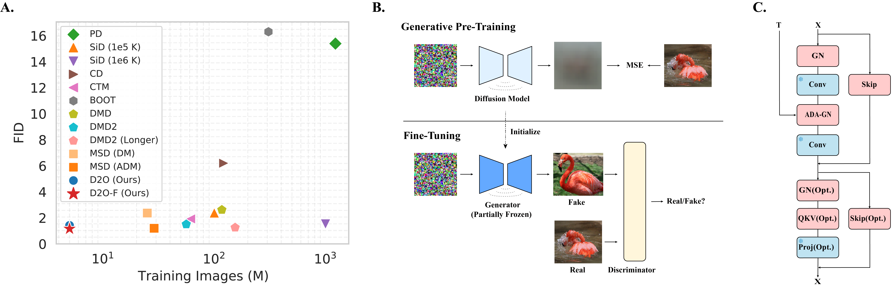

> 📢 News: Our revised paper has been accepted to ICML 2025!
> This repository is now linked to the latest version of the paper under the new name D2O. The underlying codebase has not changed, so feel free to explore and use it!

# D2O - Official Pytorch implementation 
## Revisiting Diffusion Models: From Generative Pre-training to One-Step Generation  

Original version on arXiv: [[arXiv:2405.20750]](https://arxiv.org/abs/2405.20750)  
Accepted version (ICML 2025) on arXiv: coming soon!

Bowen Zheng, Tianming Yang

*Diffusion distillation is a widely used technique
to reduce the sampling cost of diffusion models,
yet it often requires extensive training, and the
student performance tends to be degraded. Re-
cent studies show that incorporating a GAN ob-
jective may alleviate these issues, yet the under-
lying mechanism remains unclear. In this work,
we first identify a key limitation of distillation:
mismatched step sizes and parameter numbers be-
tween the teacher and the student model lead them
to converge to different local minima, rendering
direct imitation suboptimal. We further demon-
strate that a standalone GAN objective, without
relying a distillation loss, overcomes this limita-
tion and is sufficient to convert diffusion models
into efficient one-step generators. Based on this
finding, we propose that diffusion training may be
viewed as a form of generative pre-training, equip-
ping models with capabilities that can be unlocked
through lightweight GAN fine-tuning. Supporting
this view, we create a one-step generation model
by fine-tuning a pre-trained model with 85% of
parameters frozen, achieving strong performance
with only 0.2M images and near-SOTA results
with 5M images. We further present a frequency-
domain analysis that may explain the one-step
generative capability gained in diffusion training.
Overall, our work provides a new perspective for
diffusion training, highlighting its role as a power-
ful generative pre-training process, which can be
the basis for building efficient one-step generation
models.*

## Related Repositories
The references for computing FID are from [EDM](https://github.com/NVlabs/edm), and a large portion of codes in this repo is based on [EDM](https://github.com/NVlabs/edm) and [StyleGAN2-ADA](https://github.com/NVlabs/stylegan2-ada-pytorch). 

## Prepare Environments
> conda create -n D2O python=3.9

Use conda instead of pip to install TensorFlow; otherwise, the GPU driver will not be found.
> conda install tensorflow-gpu

Manually install torch to avoid conflicts.
> pip install torch==1.12.1+cu116 torchvision==0.13.1+cu116 torchaudio==0.12.1 --extra-index-url https://download.pytorch.org/whl/cu116

For training and validation
> pip install -r requirements.txt 

If you are only interested im validation or inference.
> pip install -r requirements_validation.txt 

## Training
NOTE: To release the training code as quickly as possible, we’ve modified and removed a large portion of irrelevant or experimental code for clarity. We will continuously check the results but there might be some potential issues. If you have any problems, please open an issue, and we will reply ASAP.

### Download Diffusion Checkpoints
Follow [EDM's guaidance](https://github.com/NVlabs/edm?tab=readme-ov-file#pre-trained-models), and put the checkpoints into `D2O/pretrained`, e.g., `D2O/pretrained/edm-afhqv2-64x64-uncond-ve.pkl`.

### Prepare the datasets
Follow [EDM's guaidance](https://github.com/NVlabs/edm?tab=readme-ov-file#preparing-datasets), and put the datasets into `D2O/datasets`, e.g., `D2O/datasets/cifar10-32x32.zip`
### Running
All the training commands are available in `train.sh`. You may modify the parameters according to your needs.
> sh train.sh

## Validation

### Download Checkpoints
Download from [Google Drive](https://drive.google.com/drive/folders/1U0lrxJWcLt5d3oAbVUU3FJOY0lQSrZQH?usp=sharing), and put the model to `D2O/all_ckpt`. E.g., `D2O/all_ckpt/cifar_uncond_D2O_i.pkl`

### FID
> sh validation_fid.sh

### Inception Score & Precision/Recall
**It is strongly recommended NOT to run this on A100 since it will be extremely slow for unknown reasons.**

NOTE, there is a trade off between FID and other metrics during training, checkpoints are with lowest FID.

For computing precision/recall on imagenet 64x64, download ref batches from [guided-diffusion](https://openaipublic.blob.core.windows.net/diffusion/jul-2021/ref_batches/imagenet/64/VIRTUAL_imagenet64_labeled.npz) and put it into `results/imagenet`.

Then
> cd evaluations \
> sh validate_is_pr

## CLIP-FID Metrics
Potential data leakage in FID when using a discriminator pre-trained on ImageNet has been a concern ([The Role of ImageNet Classes in Fréchet Inception Distance](https://arxiv.org/abs/2203.06026)). We provide CLIP-FID in Table \ref{tab:CLIP}. Our method consistently shows superior or competitive performance with significantly less training data. The result indicates that the superior performance is not due to information leakage but the pretrained ability gained in diffusion training.

|Dataset|Model|CLIP-FID|FID|Training Img
|-|-|-|-|-|
|CIFAR10|EDM|**0.53**|1.98||
||CD|1.26|4.10|~100M|1|
||SiD|0.65|1.92|~400M|1|
||D2O-F|0.66|**1.56**|**~5M**|
|FFHQ|EDM|1.18|2.39||
||SiD|**0.80**|1.55|~500M|1|
||D2O-F|0.81|**0.83**|**~9M**|
|AFHQv2|EDM|0.40|1.96||
||SiD|0.32|1.62|~300M|1|
||D2O-F|**0.18**|**1.24**|**~7M**|
|ImageNet|EDM|0.82|2.64||
||CD|2.93|6.87|~1000M|1|
||SiD|0.75|1.52|~930M|1|
||D2O-F|**0.51**|**1.13**|**~6M**|

## Citation
If you find our work useful, please consider citing our work:

>@misc{zheng2024diffusionmodelsinnateonestep,
     title={Diffusion Models Are Innate One-Step Generators}, \
      author={Bowen Zheng and Tianming Yang},\
      year={2024},\
      eprint={2405.20750},\
      archivePrefix={arXiv},\
      primaryClass={cs.CV},\
      url={https://arxiv.org/abs/2405.20750}, \
}

